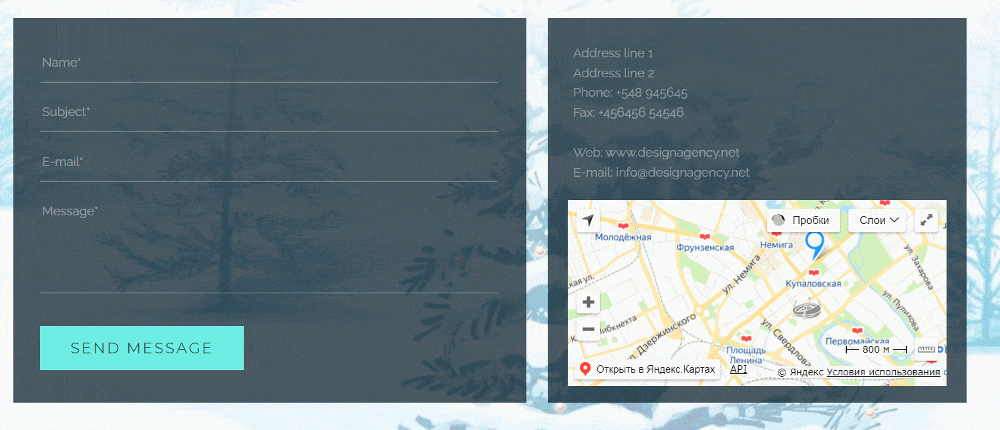
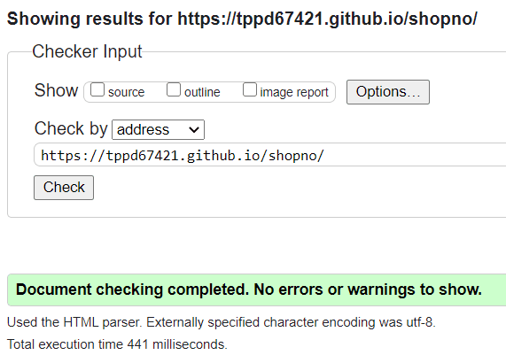

# Shopno (landing page markup)

Deployed version: [tppd67421.github.io/shopno](https://tppd67421.github.io/shopno/)

## Technologies used

- SCSS;
- Webpack;
- Msg (for modal window).

## Project description

This page was be created Pixel Perfect from PSD layout. All elements have interactive and css transition (buttons, links, etc). Page responsive for all screens.

In block 'Featured works' modal window open after click to image.

In block 'Small team' all images have hover effect. After hover you can see additional information about persot.

In last block with contact form and address information interactive map and all links have something type (simple link, tel, mailto).

Markup completed with BEM metodology.

Markup don't have errors or warnings in [validator.w3.org](https://validator.w3.org/).

